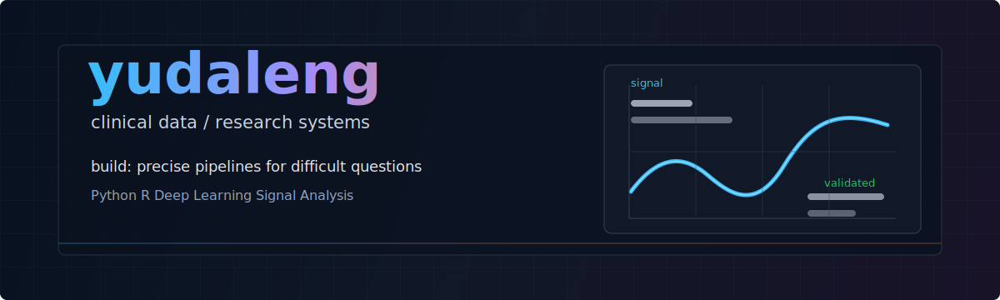

  

  
  
  

---

### Core Signal

<table>
  <tr>
    <td width="33%">
      <strong>Research</strong> 
      Clinical validation, traceable evidence, and reproducible analysis.
    </td>
    <td width="33%">
      <strong>Engineering</strong> 
      Practical pipelines, automation, and tools that keep working after the demo.
    </td>
    <td width="33%">
      <strong>Product</strong> 
      Interfaces that turn technical work into something people can actually use.
    </td>
  </tr>
</table>

### Featured Work

<table>
  <tr>
    <td width="50%">
      <a href="https://github.com/yudaleng/SpiroLLM"><strong>SpiroLLM</strong></a> 
      Modeling spirogram time series for clinical reporting, with validation around COPD-related interpretation.  
      
      
      
      
    </td>
    <td width="50%">
      <a href="https://github.com/yudaleng/COPD-Early-Prediction"><strong>COPD-Early-Prediction</strong></a> 
      Deep learning for detecting and early predicting chronic obstructive pulmonary disease from spirogram time series.  
      
      
      
    </td>
  </tr>
  <tr>
    <td width="50%">
      <a href="https://github.com/yudaleng/ScholarMind"><strong>ScholarMind</strong></a> 
      Academic literature processing for researchers: multi-source integration, deduplication, journal indicators, and abstract screening.  
      
      
    </td>
    <td width="50%">
      <a href="https://github.com/yudaleng?tab=repositories"><strong>More Systems</strong></a> 
      Experiments and tools around data workflows, scientific computing, research infrastructure, and useful automation.  
      
      
      
    </td>
  </tr>
</table>

### Tech Radar

  

  
  
  
  
  
  

### GitHub Pulse

  
  

  

### Contribution Flow

<picture>
  <source media="(prefers-color-scheme: dark)" srcset="https://raw.githubusercontent.com/yudaleng/yudaleng/output/github-contribution-grid-snake-dark.svg" />
  <source media="(prefers-color-scheme: light)" srcset="https://raw.githubusercontent.com/yudaleng/yudaleng/output/github-contribution-grid-snake.svg" />
  
</picture>

---

  <strong>Build precise tools for difficult questions.</strong> 
  respiratory signals / clinical data / reproducible engineering

